# E-shop電子商務網站

此為Single Page App，模擬電子網站網站，從挑選商品，加到購物車，到最後結帳。

前端框架：react，版本17.0.2，主要是使用functional component，使用hook如useState、useEffect、useContext等功能操作
後端程式語言：node.js，版本v16.14.0
資料庫存放：Mongo Altas
作業期間：2022/02~2022/04

## 功能及特色介紹：

### 1.首頁

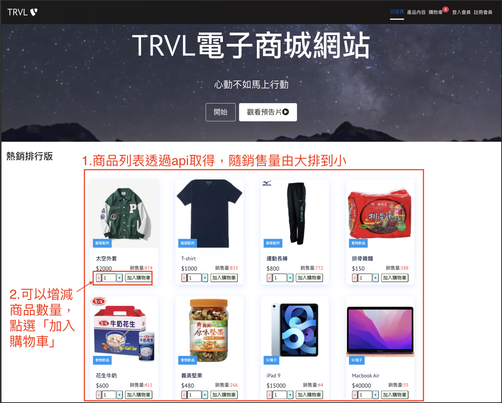

### 2.產品內容

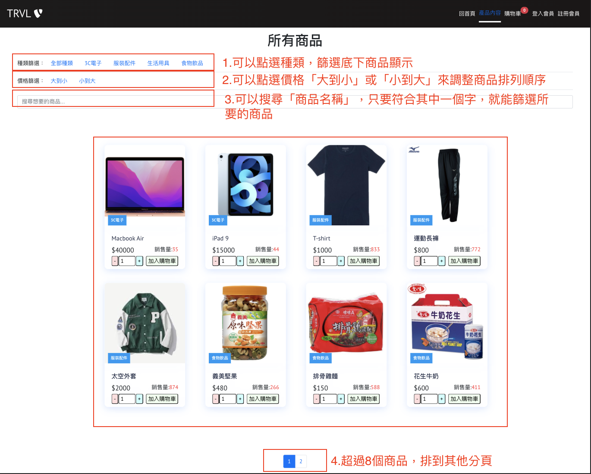

### 3.提供會員登入及註冊。

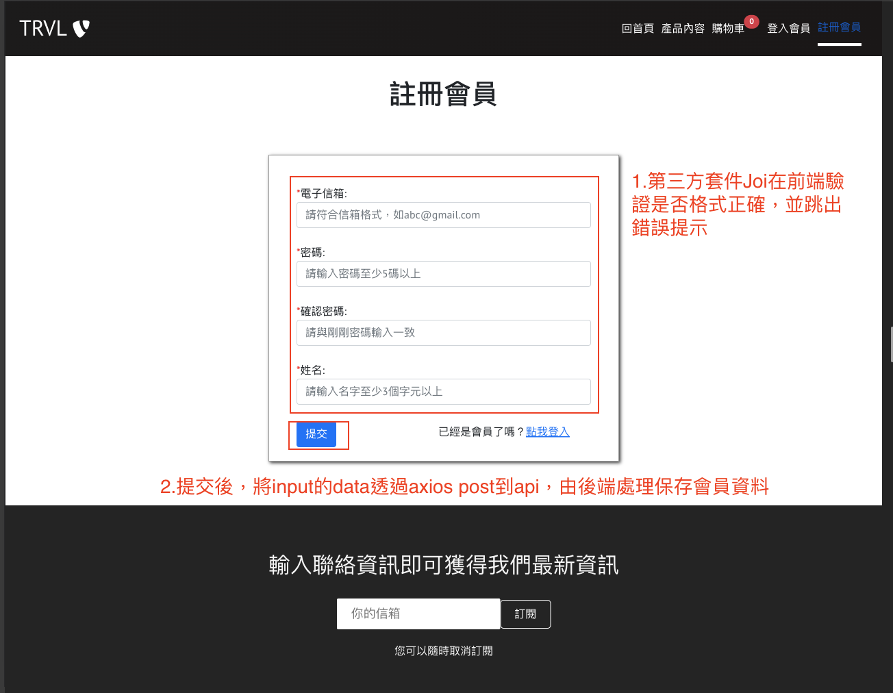
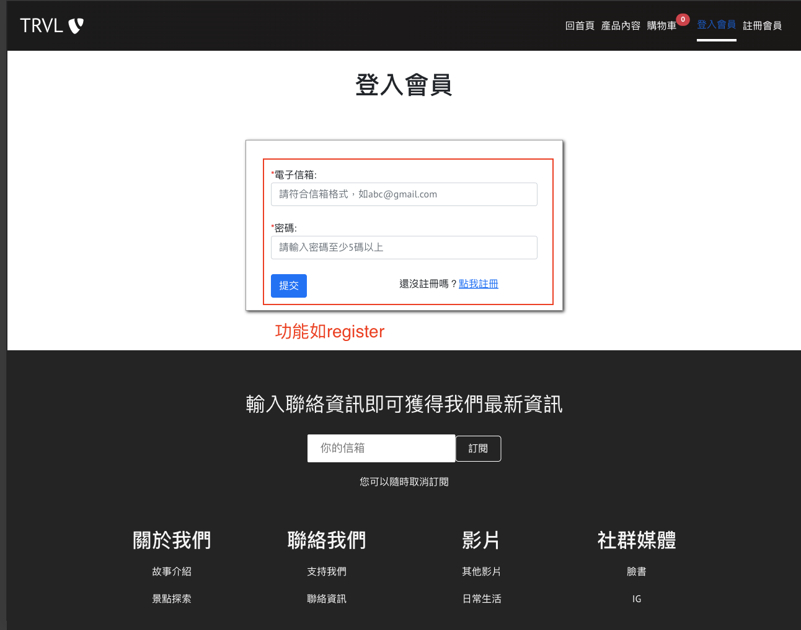

### 4.更新產品

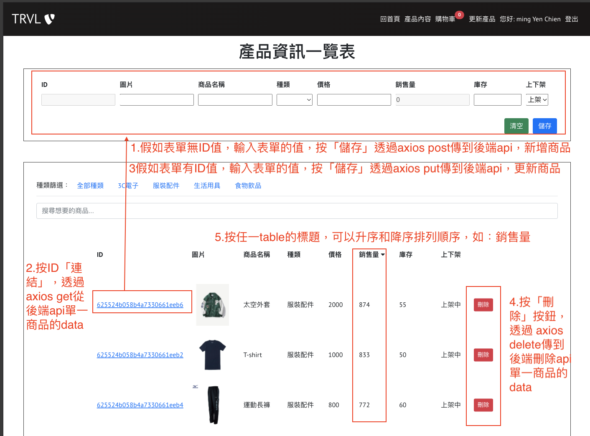

### 5.購物車

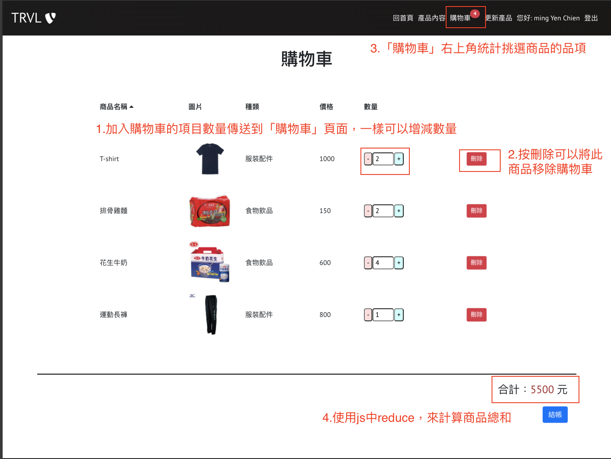

### 6.手機版menu

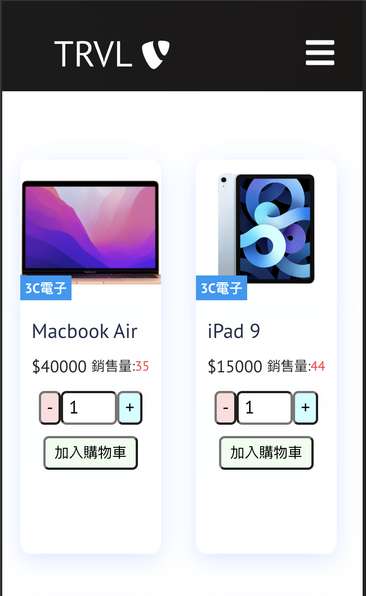
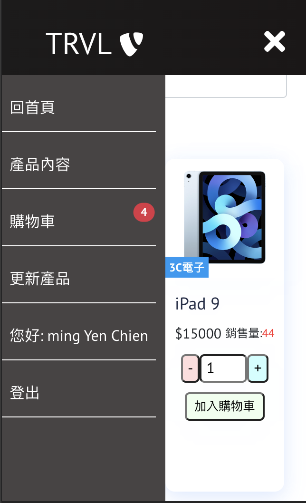

### 7.加入、刪除購物車跳出提示訊息

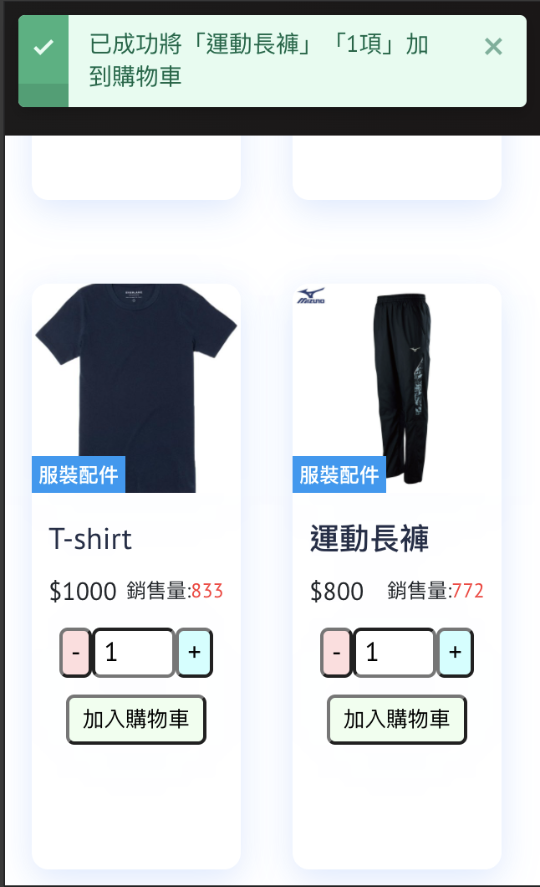
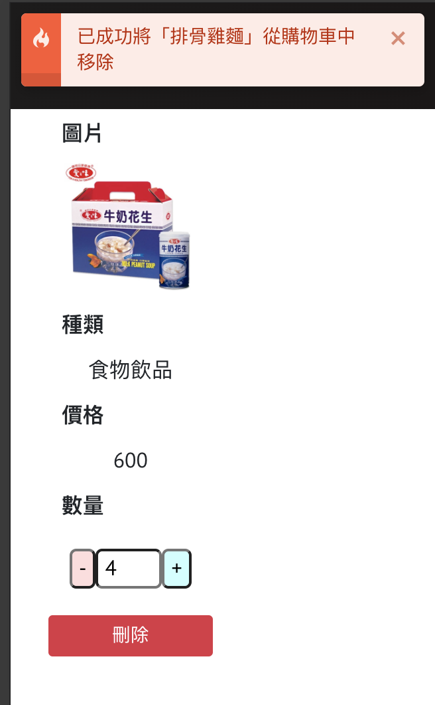

### 8.串接stripe第三方付費網站

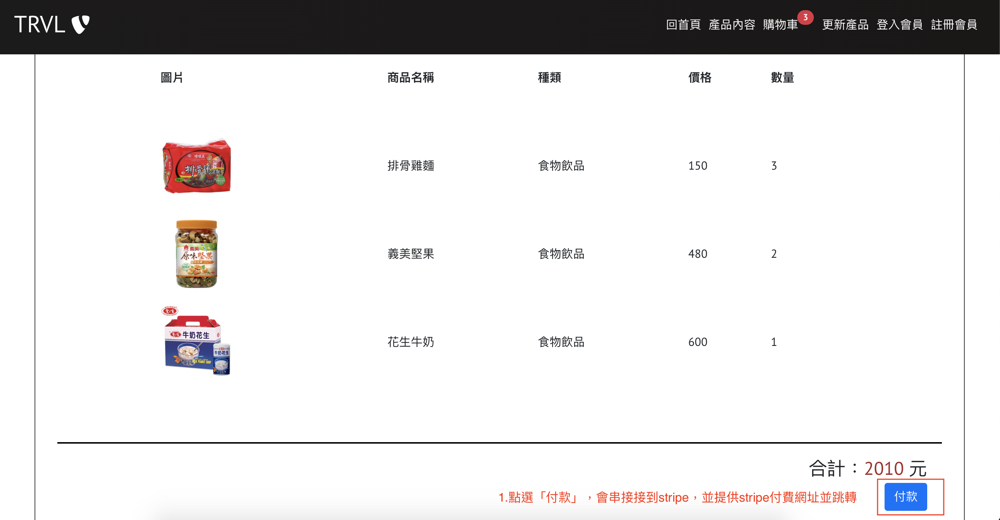
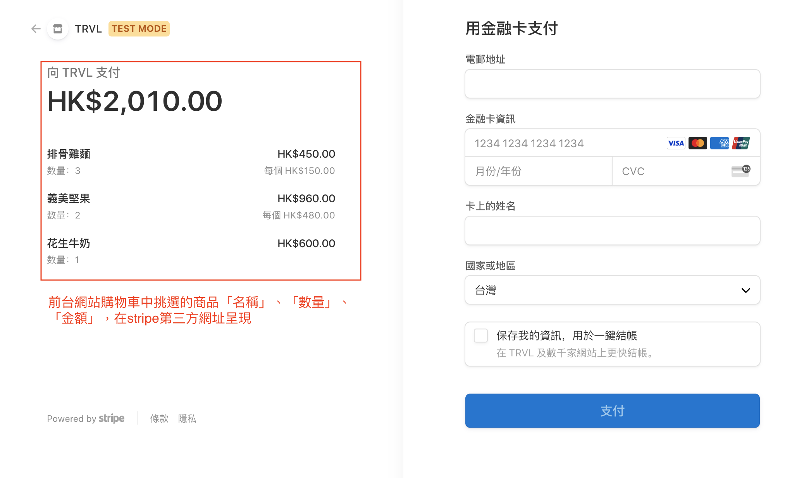